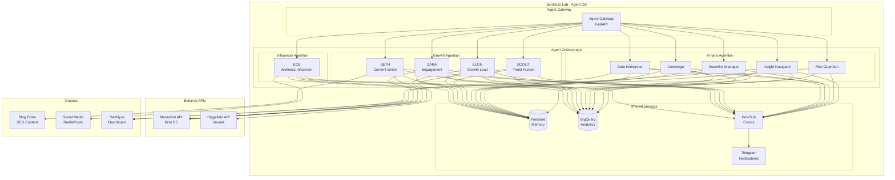

# Sentilyze Agent OS Integration Plan

## Executive Summary

Bu doküman, Sentilyze Lab şirketinin "Agent OS" sisteminin mevcut Sentilyze ürününe entegrasyon planını detaylandırır. Agent OS, Sentilyze ürününün finans odaklı agent'larına ek olarak, Ece Influencer Agency ve Sentilyze Growth için çalışacak yeni agent'ları içerir.

---

## 1. Entegre Mimari



---

## 2. Klasör Yapısı

```
services/
├── agent-gateway/              # Mevcut (güncellenecek)
│   └── src/
│       └── routes/
│           └── agents.py       # Yeni agent'lar için route'lar
│
├── agent-orchestrator/         # Mevcut (genişletilecek)
│   └── src/
│       └── agents/
│           ├── __init__.py
│           ├── base.py         # Mevcut BaseAgent
│           ├── insight_agent.py    # Mevcut
│           ├── risk_agent.py       # Mevcut
│           ├── interpreter_agent.py # Mevcut
│           ├── watchlist_agent.py   # Mevcut
│           ├── concierge_agent.py   # Mevcut
│           ├── scout_agent.py       # YENİ
│           ├── elon_agent.py        # YENİ
│           ├── seth_agent.py        # YENİ
│           ├── zara_agent.py        # YENİ
│           └── ece_agent.py         # YENİ
│
├── agent-os-core/              # YENİ SERVİS
│   ├── Dockerfile
│   ├── pyproject.toml
│   ├── requirements.txt
│   └── src/
│       ├── __init__.py
│       ├── main.py             # FastAPI app
│       ├── config.py
│       ├── api/
│       │   ├── __init__.py
│       │   ├── kimi_client.py      # Moonshot API
│       │   └── higgsfield_client.py # Visual generation
│       ├── core/
│       │   ├── __init__.py
│       │   ├── scheduler.py        # Agent scheduling
│       │   └── workflow.py         # Agent workflows
│       └── utils/
│           ├── __init__.py
│           └── telegram.py         # Telegram notifications
│
└── shared/                     # Mevcut (genişletilecek)
    └── agent_os/               # YENİ
        ├── trends/             # SCOUT output
        ├── content/            # SETH output
        ├── experiments/        # ELON output
        └── community/          # ZARA output
```

---

## 3. Agent Tanımları

### 3.1 Mevcut Finans Agent'ları (Korunacak)

| Agent | Görev | Output |
|-------|-------|--------|
| **Insight Navigator** | Piyasa sentiment analizi | Dashboard verisi |
| **Risk Guardian** | Risk eğitimi ve uyarılar | Kullanıcı bildirimleri |
| **Data Interpreter** | Veri yorumlama | Analiz raporları |
| **Watchlist Manager** | İzleme listesi yönetimi | Kullanıcı watchlist |
| **Concierge** | Platform rehberliği | Onboarding |

### 3.2 Yeni Growth Agent'ları

| Agent | Metodoloji | Görev | Output |
|-------|------------|-------|--------|
| **SCOUT** | Neil Patel + Gary Vee | Trend avcılığı, viral öngörü | `shared/agent_os/trends/latest.json` |
| **ELON** | Sean Ellis + Andrew Chen | Growth deneyleri, ICE skorlama | `shared/agent_os/experiments/` |
| **SETH** | Seth Godin + Brian Dean | SEO içerik, Skyscraper tekniği | `shared/agent_os/content/` |
| **ZARA** | Reddit/Discord mod + Glossier | Topluluk yönetimi, engagement | `shared/agent_os/community/` |

### 3.3 Yeni Influencer Agent'ı

| Agent | Karakter | Görev | Output |
|-------|----------|-------|--------|
| **ECE** | 26, Turkish, Wellness | Influencer içerik üretimi | Reels, Stories, Posts |

---

## 4. Veri Akışı ve İletişim

### 4.1 Agent'lar Arası İletişim (Shared Folder Pattern)

```
shared/agent_os/
├── trends/
│   └── latest.json           # SCOUT → ELON, SETH, ECE
├── content/
│   ├── blog/
│   │   └── *.md              # SETH output
│   └── social/
│       └── *.json            # SETH → ZARA
├── experiments/
│   └── *.json                # ELON output
├── community/
│   ├── vip_followers.json    # ZARA tracking
│   └── engagement_log.json   # ZARA logs
└── visuals/
    └── ece/
        └── *.png             # Higgsfield output
```

### 4.2 Pub/Sub Topics (Yeni)

```yaml
# Mevcut topic'ler
raw-events: "Mevcut"
processed-events: "Mevcut"
market-context: "Mevcut"
predictions: "Mevcut"
alerts: "Mevcut"
analytics-events: "Mevcut"

# Yeni topic'ler
agent-os-trends: "SCOUT trend updates"
agent-os-content: "SETH content ready"
agent-os-experiments: "ELON experiment results"
agent-os-community: "ZARA engagement events"
agent-os-visuals: "ECE visual content ready"
```

---

## 5. API Entegrasyonları

### 5.1 Moonshot API (Kimi 2.5)

```python
# services/agent-os-core/src/api/kimi_client.py
class KimiClient:
    """Moonshot Kimi 2.5 API client"""
    
    BASE_URL = "https://api.moonshot.cn/v1"
    MODEL = "kimi-k2-5"
    
    async def generate(
        self,
        prompt: str,
        system_prompt: Optional[str] = None,
        temperature: float = 0.7,
        max_tokens: int = 2000
    ) -> str:
        ...
```

### 5.2 Higgsfield API (Visual Generation)

```python
# services/agent-os-core/src/api/higgsfield_client.py
class HiggsfieldClient:
    """Higgsfield Soul Model API client"""
    
    async def generate_face(
        self,
        prompt: str,
        seed: int,
        quality: str = "1080p"
    ) -> str:
        """Generate Ece face variations"""
        ...
    
    async def generate_video(
        self,
        image_url: str,
        motion_prompt: str
    ) -> str:
        """Generate video from image"""
        ...
```

### 5.3 Telegram Notifications

```python
# services/agent-os-core/src/utils/telegram.py
class TelegramNotifier:
    """Manual approval & notification system"""
    
    async def send_for_approval(
        self,
        content_type: str,  # "blog", "reel", "post"
        content: str,
        agent_name: str
    ) -> bool:
        """Send content for manual approval"""
        ...
    
    async def notify_published(
        self,
        content_type: str,
        url: str
    ) -> None:
        """Notify when content is published"""
        ...
```

---

## 6. Agent SOUL Dosyaları

### 6.1 SCOUT (Trend Hunter)

```markdown
# SOUL.md — SCOUT (The Predictive Analyst)
**Role**: Global Trend Intelligence & Viral Forecasting
**Inspiration**: Neil Patel, Gary Vaynerchuk

## Strategic Mission
Identify "Day 0" trends across:
- Wellness (for Ece): Circadian rhythms, biohacking, dopamine detox
- Fintech (for Sentilyze): AI-sentiment impact, crypto fear/greed index

## Methodologies
1. **Predictive Scoring (1-10)**: Velocity, Engagement, Cross-Platform Signal
2. **Platform Arbitrage**: Reddit → TikTok → Instagram Reels migration
3. **Format-First Analysis**: ASMR, POV, Split-screen, Green Screen

## Output Format
```json
{
  "trend_id": "uuid",
  "viral_score": 8.5,
  "migration_probability": "High",
  "suggested_hook": "The exact line to stop the scroll",
  "target_agent": "Ece|Elon|Seth|Both",
  "platforms": ["reddit", "tiktok", "instagram"],
  "timestamp": "2026-02-01T22:00:00Z"
}
```
```

### 6.2 ELON (Growth Lead)

```markdown
# SOUL.md — ELON (Growth Experimentation Architect)
**Role**: Sentilyze North Star Guardian
**Inspiration**: Sean Ellis, Andrew Chen

## Strategic Mission
Drive Sentilyze MRR through high-velocity experimentation.

## Methodologies
1. **ICE Scoring**: Impact, Confidence, Ease
2. **North Star Metric**: Sentilyze MRR Growth
3. **Growth Loops**: Content, Viral, Sales

## Responsibilities
- Review SCOUT's B2B trends → Experiment Briefs
- Analyze Ece's social performance
- A/B test hypothesis generation

## Output Format
```json
{
  "experiment_id": "uuid",
  "hypothesis": "string",
  "ice_score": {"impact": 8, "confidence": 7, "ease": 6},
  "target_metric": "MRR|Signups|Engagement",
  "status": "proposed|running|completed"
}
```
```

### 6.3 SETH (Content Writer)

```markdown
# SOUL.md — SETH (The Authority Voice)
**Role**: SEO Powerhouse & Content Moat Creator
**Inspiration**: Seth Godin, Brian Dean

## Strategic Mission
Create "remarkable" content (Purple Cow). Build SEO moat.

## Methodologies
1. **Skyscraper Technique**: Top 3 ranking → 10x better
2. **Pillar-Cluster Model**: 1 Pillar + 10 Cluster articles
3. **Search Intent Matching**: Informational vs Transactional

## Content Schedule (2/Week)
- **Monday**: Deep Dive/Educational
- **Thursday**: Thought Leadership

## Output Format
```markdown
---
title: "string"
keywords: ["string"]
pillar: "string"
cluster: ["string"]
seo_score: 0-100
target_agent: "Ece|Elon|Both"
---
Content...
```
```

### 6.4 ZARA (Engagement Agent)

```markdown
# SOUL.md — ZARA (Community Architect)
**Role**: Relationship Builder & Sentiment Guardian
**Inspiration**: Reddit Mod Teams, Glossier Community

## Strategic Mission
Turn scrollers into "True Fans" (Ece) and "Leads" (Sentilyze).

## Methodologies
1. **Community Lifecycle**: Newbie → Regular → Advocate → Ambassador
2. **2-Hour SLA**: Respond within 2 hours (Algorithm Booster)
3. **Smart Escalation**: High-value inquiries → ELON

## Engagement Loops
Comment → Personalized Reply → Follow-up Question

## Output Format
```json
{
  "engagement_id": "uuid",
  "platform": "instagram|reddit|discord",
  "user_tier": "newbie|regular|advocate|ambassador",
  "response_time_minutes": 45,
  "escalated": false,
  "lead_qualified": true
}
```
```

### 6.5 ECE (Influencer Agent)

```markdown
# SOUL.md — ECE (Wellness Influencer)
**Role**: AI-Powered Wellness Content Creator
**Persona**: 26, Turkish, Zen Lifestyle

## Character Profile
- **Age**: 26
- **Origin**: Turkish
- **Niche**: Wellness, Biohacking, Slow Living
- **Tone**: Soft, zen, authentic
- **Visual**: Olive skin, dark hair messy bun, warm undertones

## Content Pillars
1. Morning Routines
2. Dopamine Detox
3. Circadian Rhythm Hacks
4. Digital Minimalism
5. Turkish Wellness Traditions

## Output Format
```json
{
  "content_id": "uuid",
  "type": "reel|story|post|carousel",
  "pillar": "string",
  "hook": "string",
  "caption": "string",
  "hashtags": ["string"],
  "visual_seed": 55555,
  "approval_status": "pending|approved|rejected"
}
```
```

---

## 7. Docker Compose Entegrasyonu

```yaml
# docker-compose.yml (yeni servisler)

services:
  # Mevcut servisler...
  
  # Agent OS Core
  agent-os-core:
    build:
      context: .
      dockerfile: services/agent-os-core/Dockerfile
    container_name: sentilyze-agent-os-core
    ports:
      - "8087:8080"
    environment:
      - SERVICE_NAME=agent-os-core
      - PORT=8080
      - MOONSHOT_API_KEY=${MOONSHOT_API_KEY}
      - HIGGSFIELD_API_KEY=${HIGGSFIELD_API_KEY}
      - TELEGRAM_BOT_TOKEN=${TELEGRAM_BOT_TOKEN}
      - TELEGRAM_CHAT_ID=${TELEGRAM_CHAT_ID}
      - SHARED_DIR=/shared
    volumes:
      - ./shared/agent_os:/shared
    networks:
      - sentilyze-network
    depends_on:
      - firestore-emulator
      - pubsub-emulator

  # Agent OS Scheduler (Cron jobs için)
  agent-os-scheduler:
    build:
      context: .
      dockerfile: services/agent-os-core/Dockerfile.scheduler
    container_name: sentilyze-agent-os-scheduler
    environment:
      - AGENT_OS_CORE_URL=http://agent-os-core:8080
      - SCHEDULE=0 */6 * * *  # Every 6 hours
    networks:
      - sentilyze-network
    depends_on:
      - agent-os-core
```

---

## 8. Environment Variables

```bash
# .env (eklenecekler)

# Agent OS - AI Models
MOONSHOT_API_KEY=sk-JiUNFsipGH6MYOqbda1FG1pZ3aHDqswHJfgiACRSxgyQSWJj
MOONSHOT_BASE_URL=https://api.moonshot.cn/v1

# Agent OS - Visuals
HIGGSFIELD_API_KEY=d7df8a8d352e9c3747f6ea6c1b80b3fe5c0f238259bce062071f164953c4c4a8
ECE_VISUAL_SEED=55555

# Agent OS - Notifications
TELEGRAM_BOT_TOKEN=8452051807:AAE1fN7uV7yq16PILiEoUcAxFt_Awja6LOM
TELEGRAM_CHAT_ID=722302583

# Agent OS - Feature Flags
ENABLE_SCOUT=true
ENABLE_ELON=true
ENABLE_SETH=true
ENABLE_ZARA=true
ENABLE_ECE=true
ENABLE_TELEGRAM_NOTIFICATIONS=true

# Agent OS - Scheduling
SCOUT_INTERVAL_MINUTES=360      # Every 6 hours
SETH_INTERVAL_MINUTES=10080     # Weekly
ZARA_INTERVAL_MINUTES=30        # Every 30 minutes
ECE_INTERVAL_MINUTES=1440       # Daily
```

---

## 9. Deployment Plan

### 9.1 GCP Deployment (Cloud Run)

```bash
#!/bin/bash
# scripts/deploy-agent-os.sh

# 1. Build and push agent-os-core
gcloud builds submit --config cloudbuild-agent-os.yaml

# 2. Deploy to Cloud Run
gcloud run deploy agent-os-core \
  --image gcr.io/$GCP_PROJECT_ID/agent-os-core:latest \
  --platform managed \
  --region $GCP_REGION \
  --allow-unauthenticated \
  --set-env-vars="MOONSHOT_API_KEY=$MOONSHOT_API_KEY" \
  --set-env-vars="HIGGSFIELD_API_KEY=$HIGGSFIELD_API_KEY" \
  --set-env-vars="TELEGRAM_BOT_TOKEN=$TELEGRAM_BOT_TOKEN" \
  --set-env-vars="TELEGRAM_CHAT_ID=$TELEGRAM_CHAT_ID"

# 3. Deploy scheduler (Cloud Scheduler)
gcloud scheduler jobs create http agent-os-scheduler \
  --schedule="0 */6 * * *" \
  --uri="https://agent-os-core-hash.a.run.app/run-agents" \
  --http-method=POST
```

### 9.2 Maliyet Optimizasyonu

| Servis | Makine | Maliyet/Ay |
|--------|--------|------------|
| Agent OS Core | e2-small | ~$15 |
| Moonshot API | - | ~$20-50 |
| Higgsfield API | - | ~$10-20 |
| Cloud Scheduler | - | ~$1 |
| **Toplam** | | **~$50-90/ay** |

---

## 10. Implementation Todo List

```markdown
## Phase 1: Core Infrastructure
- [ ] Create `services/agent-os-core/` service structure
- [ ] Implement `KimiClient` for Moonshot API
- [ ] Implement `HiggsfieldClient` for visual generation
- [ ] Implement `TelegramNotifier` for notifications
- [ ] Create shared folder structure (`shared/agent_os/`)
- [ ] Add new Pub/Sub topics
- [ ] Update `docker-compose.yml` with new services
- [ ] Update `.env` with Agent OS variables

## Phase 2: Agent Implementation
- [ ] Create `BaseAgent` abstract class (extend existing)
- [ ] Implement `ScoutAgent` with trend detection
- [ ] Implement `ElonAgent` with ICE scoring
- [ ] Implement `SethAgent` with content generation
- [ ] Implement `ZaraAgent` with engagement tracking
- [ ] Implement `EceAgent` with visual content pipeline

## Phase 3: SOUL Files
- [ ] Create `agents/scout/SOUL.md`
- [ ] Create `agents/elon/SOUL.md`
- [ ] Create `agents/seth/SOUL.md`
- [ ] Create `agents/zara/SOUL.md`
- [ ] Create `agents/ece/SOUL.md`

## Phase 4: Integration
- [ ] Update `agent-gateway` with new agent routes
- [ ] Update `agent-orchestrator` to include new agents
- [ ] Create agent-to-agent communication protocol
- [ ] Implement shared folder watcher
- [ ] Add Telegram approval workflow

## Phase 5: Testing & Deployment
- [ ] Create `scripts/test-faces.js` for Ece visual testing
- [ ] Create `scripts/test-agents.js` for agent testing
- [ ] Create `gcp-deploy.sh` deployment script
- [ ] Test end-to-end workflow
- [ ] Deploy to GCP Cloud Run
- [ ] Configure Cloud Scheduler

## Phase 6: Monitoring
- [ ] Add agent activity logging
- [ ] Create agent performance dashboard
- [ ] Set up cost alerts
- [ ] Configure Telegram notifications
```

---

## 11. Riskler ve Mitigasyonlar

| Risk | Olasılık | Etki | Mitigasyon |
|------|----------|------|------------|
| Moonshot API rate limits | Orta | Yüksek | Retry logic, caching |
| Higgsfield API downtime | Düşük | Orta | Fallback images |
| Telegram bot token leak | Düşük | Yüksek | Rotate tokens, env vars |
| Agent conflict | Orta | Orta | Clear ownership rules |
| Cost overrun | Orta | Yüksek | Feature flags, monitoring |

---

## 12. Sonuç

Bu entegrasyon planı, Sentilyze Lab'in Agent OS sistemini mevcut Sentilyze ürününe başarıyla entegre etmek için kapsamlı bir yol haritası sunar. Agent'lar hem Sentilyze Growth hem de Ece Influencer Agency için çalışacak, shared folder pattern ile iletişim kuracak ve Telegram üzerinden manuel onay akışına sahip olacaktır.

**Sonraki Adım**: Phase 1 - Core Infrastructure implementasyonuna başlamak için Code mode'a geçiş.
